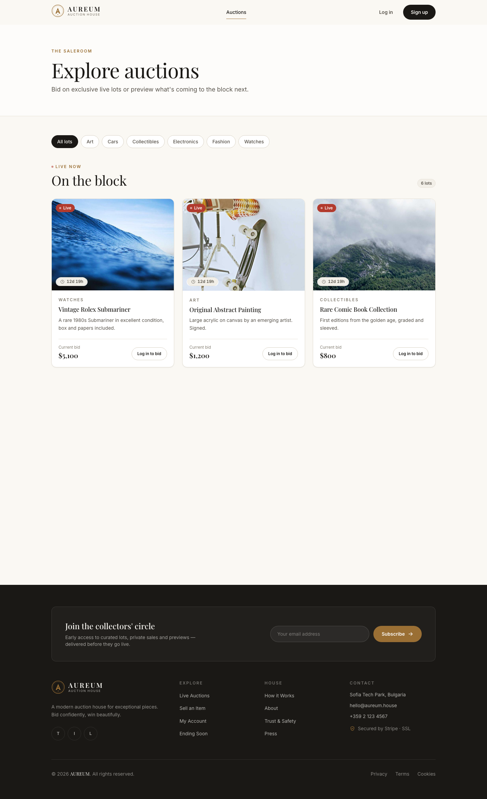
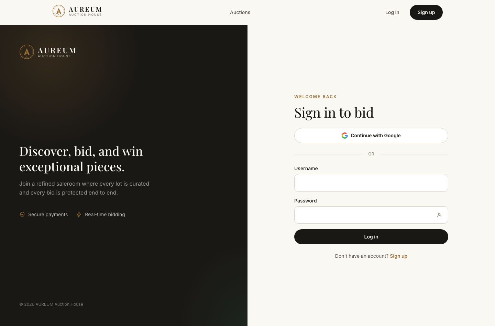

# Auction Platform

A full-stack online auction application — **real-time bidding**, secure authentication, and Stripe
payments. Java / Spring Boot backend, React frontend.

- **Backend** → [`backend/`](backend) — Java 17 · Spring Boot · PostgreSQL · WebSockets · Stripe · JWT + OAuth2
- **Frontend** → [`frontend/`](frontend) — React · Axios · STOMP/SockJS · Stripe.js

## Screenshots

| Landing | Auctions |
|---------|----------|
|  |  |

| Live bidding | Sign in |
|--------------|---------|
|  |  |

## What it does

Users sign up (with email verification) or log in with Google, browse and create auctions, and place
**live bids** that are pushed to every viewer over WebSockets in real time. When an auction closes, the
winning bidder pays through Stripe. There's in-app chat and an admin area.

## Highlights

- **Real-time bidding** — bids broadcast instantly over WebSockets (STOMP/SockJS); the UI updates with
  no refresh, backed by a live countdown.
- **Concurrency-safe bids** — the backend uses `@Version` optimistic locking, so two simultaneous bids
  can't silently overwrite each other (a conflict returns `409`).
- **Secure auth** — JWT login *and* Google OAuth2, role-based access, email verification.
- **Payments** — Stripe Checkout + webhooks for the winning bidder.
- **Robust API** — typed exceptions mapped to RFC 7807 `ProblemDetail` responses (404 / 400 / 403 / 409).
- **Well tested** — 76 backend tests: Mockito unit tests + Testcontainers integration tests on a real PostgreSQL.
- **Configurable & secret-free** — all secrets are environment-injected; the frontend's API URL is a
  single env var, so the same build runs against any backend.

## Architecture

```
┌────────────┐   REST (JWT)     ┌──────────────────┐
│  React     │ ───────────────▶ │  Spring Boot     │ ──▶ PostgreSQL
│  frontend  │ ◀── WebSockets ─ │  backend         │ ──▶ Stripe · Cloudinary · SMTP
└────────────┘   (live bids)    └──────────────────┘
```

## Tech stack

**Backend:** Java 17 · Spring Boot 3.4 · Spring Security · Spring Data JPA · PostgreSQL ·
WebSocket/STOMP · Stripe · Cloudinary · JWT · Maven · Testcontainers · Mockito.
**Frontend:** React (CRA) · React Router · Axios · `@stomp/stompjs` + SockJS · `@stripe/stripe-js`.

## Getting started

Run the backend and frontend in two terminals (each has its own README with details):

```bash
# backend — needs PostgreSQL + env vars (see backend/.env.example)
cd backend && ./mvnw spring-boot:run          # :8080

# frontend
cd frontend && npm install && npm start        # :3000
```

See [`backend/README.md`](backend/README.md) and [`frontend/README.md`](frontend/README.md) for full details.

## Repository layout

```
auction-platform/
├── backend/     Spring Boot API — auth, bidding, payments, WebSockets
├── frontend/    React app — live bidding UI, checkout, auth
└── docs/        screenshots
```
